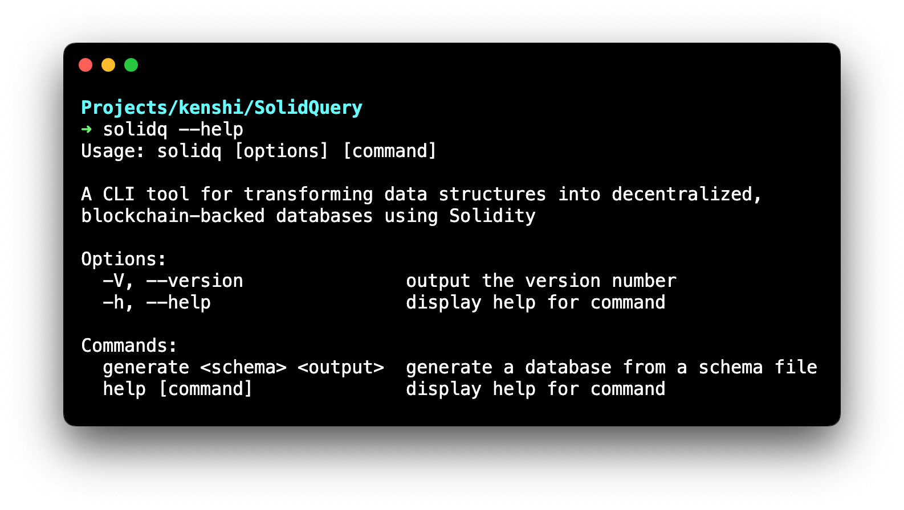

# SolidQuery


SolidQuery is an innovative open-source project that generates a decentralized
database based on your unique data schema. Unlike traditional databases,
SolidQuery provides a highly customized and fully decentralized data management
solution for the Ethereum blockchain, allowing seamless integration with your
DApps.

## Key Features

- **Custom Schema Generation:** Define your data structure using YAML and let
  SolidQuery do the rest.
- **Decentralized Database:** Leverage the power of the Ethereum blockchain for
  your application's data management.
- **Data Indexing:** Built-in functionality for data indexing.
- **Solidity Event Emitting:** Automates the generation of Solidity events for
  data creation, update, and deletion.

Learn more about SolidQuery [here](https://kenshi.io/solidquery).

## How to Use

### Playground

You can find the SolidQuery playground [here](https://kenshi.io/solidquery/playground).

### Installation

```shell
npm install -g solidq
```

### Usage

Create a YAML file to define your data schema. Run the following command to
generate the Solidity contract:

```shell
solidq schema.yaml MyContract.sol
```



### Example Schema

```yaml
Book:
  Name: string
  Author: string indexed
  Published: uint256 indexed

Person:
  Name: string
  Birth: uint256 indexed
```

is equivalent to

```yaml
Book:
  Name: string
  Author:
    type: string
    indexed: true
  Published:
    type: uint256
    indexed: true

Person:
  Name: string
  Birth:
    type: uint256
    indexed: true
```


## Contributing

We welcome and appreciate all contributions. If you're interested in
contributing, please see our [Contributing Guide](CONTRIBUTING.md).

## License

SolidQuery is [Apache 2.0 licensed](LICENSE).

## Contact

Feel free to contact us at [our contact page](https://kenshi.io/contact) if you
have questions or need assistance.
